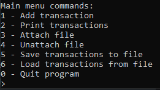
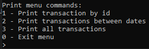

    ## Console Finance Tracker

Simple console Finance Tracker that can track current transactions, display them, add them from files, and save them to files.

## Techonolies Used

The program was created using:

* IntelliJ IDEA 2024.1.4
* JDK 22.0.2

## Installation and Launch

* Download and extract the Console-Finance-Tracker archive from the [releases](https://github.com/qwert312/Console-Finance-Tracker/releases/latest).
* Run start.bat

To work with the source code, simply download and extract the Source archive from the same location, and then open the Console-Finance-Tracker-2.0.0 folder.

## Usage

The financial tracker can do the following:

1. Store transactions (only during the program's runtime)
2. Input and add transactions
3. Print stored transactions (by ID, between specific dates, or all at once)
4. Save transactions to a .csv file (by ID, between specific dates, or all at once).
5. Load transactions from a .csv file (by ID, between specific dates, or all at once).

To work with the file, it must always be attached first; otherwise, the corresponding commands for working with it will not be displayed. An attached file can be detached, in which case all commands for working with it will disappear (until it is reattached).

## Screenshots

Main menu commands when no file is attached.

Main menu commands when file is attached.

Print menu commands.

Save menu commands.

Load menu commands.

